_This Contrail_Cookbook has been written based on a [Tungsten Fabric](https://tungsten.io/) cluster, from early October trunk build and Openstack Queens._ 

# Virtual Networks

On below screenhoot, we can notice
- Red VN having 3 VMs attached: vSRX_3, vSRX_4 and vSRX_5
- We can understand on which compute the VM runs. Besides, they all run on different computes. 

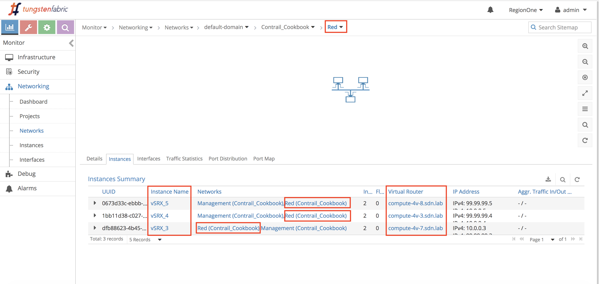

The following screenshoots show for each VM the associated IP@ and Mac@
- vSRX_3: 10.0.0.3 / 02:42:d3:0f:50:35
- vSRX_4: 10.0.0.4 / 02:35:62:da:f5:b0
- vSRX_5: 10.0.0.5 / 02:03:04:6d:19:c1

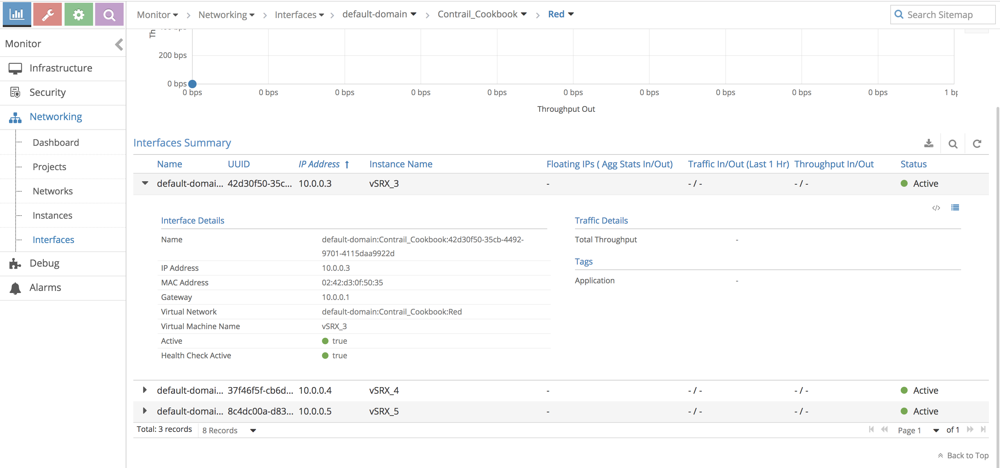

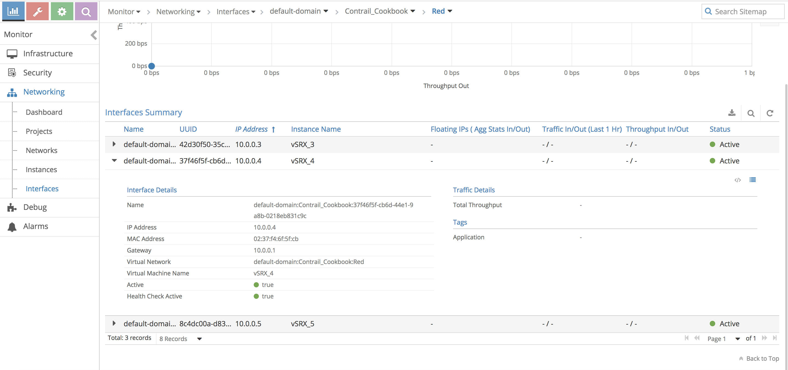

## Advanced Options

### Forwarding Mode
Contrail supports 3 forwarding modes: L2 and L3, L2 only and L3 only.

This can be set on a per VN basis, see below.

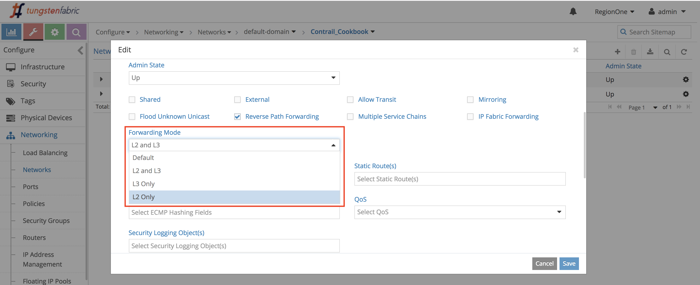

In next sections, we will focus:
- only on "Red" VN
- from compute-4v-7.sdn.lab that is hosting vSRX-3

Contrail is "Configuration based Learning": configuration for a virtual-machine-interface contains both IP address and MAC address for the interface. For virtual-machines spawned on a compute node, the vrouter will learn IP to MAC address binding from the configuration (Contrail does not perform mac-learning). The MAC binding information is exported in EVPN Routes to the Control Node.

VRouter behavior on receiving an ARP Request (from VM to vRouter):

    Do Inet route lookup for the IP Destination
    If Route found for the IP Destination
        If Proxy Flag set in the route
            If MAC Stitching information present in the route
                Send ARP Respone with the MAC present in stitching information
            Else // MAC Stitching not found
                If Flood Flag set in the route
                    Flood the ARP packet
                Else // PROXY set, No-Flood, No-MAC Stitching
                    Send ARP response with VRouter MAC address
        Else // Proxy Flag not set
            If Flood flag set in the Route
                Flood the ARP packet
            Else // Proxy Not set, Flood not set
                Drop the packet
    Else // Route not found
        Flood the ARP

_Note: ARP processing is greatly further detailed here: https://github.com/Juniper/contrail-controller/wiki/Contrail-VRouter-ARP-Processing_ 

#### L2 and L3

In this mode IPv4 traffic lookup is done via IP FIB and all non IPv4 traffic is directed to MAC FIB.

This is the default option and should be used unless having a specific requirement.

In below, it is worth mentioning that since we are on compute-4v-7.sdn.lab that is hosting vSRX-3, 10.0.0.3/32 has local tap-interface, while for instance 10.0.0.4/32 has tunneling via MPLSoUDP since being on another compute. Simiraly, 02:42:d3:0f:50:35 has local tap-interface while for instance 02:37:f4:6f:5f:cb has tunneling via MPLSoUDP since being on another compute

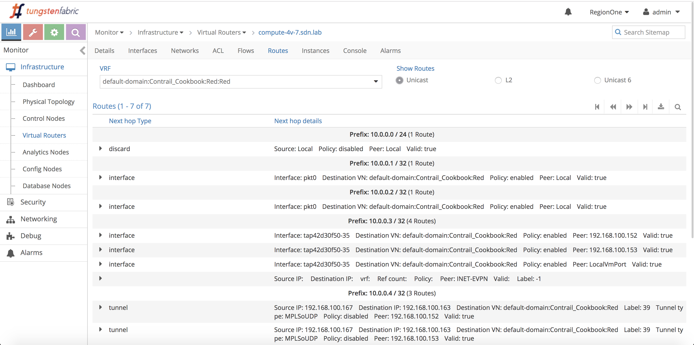

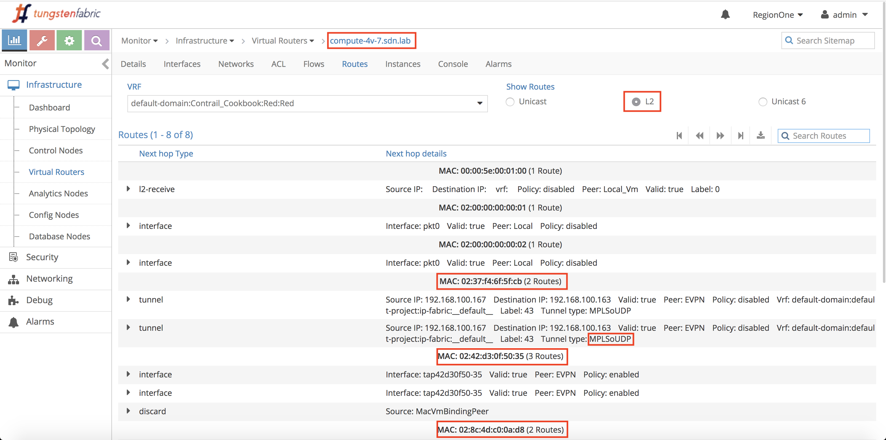

##### Known IP@ and mac@

Below screenshot shows on compute-4v-7.sdn.lab that vRouter has associated 10.0.0.4 to 02:37:f4:6f:5f:cb. It has "P" in flag to say "Proxy ARP".

Below vSRX_3 pings vSRX_4 (ARP table on vSRX_3 was cleared). We notice that vSRX_3 sends an ARP request for 10.0.0.4 and **vRouter** will answer the ARP request thanks to mac@ known above. Besides, on vif interface we can see the flag "L3L2".

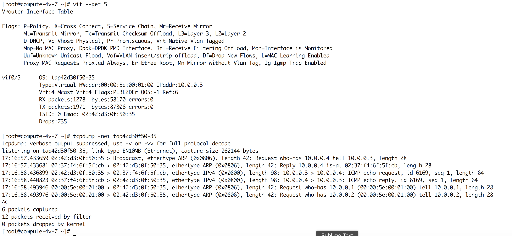

##### Unknown IP@

_This is a corner case and most of the time the result of bad VNF implementation._ 

Here we have unconfigured DHCP on vSRX_5 and manually set IP@ 10.0.0.12/32. So as explained before, because Contrail knows the IP@ and Mac@ bindings via OpenStack, this IP@ will be unknown.

Below the mac@ of IP@ 10.0.0.12/32 is resolved, but ICMP packets are dropped since unknown IP@.

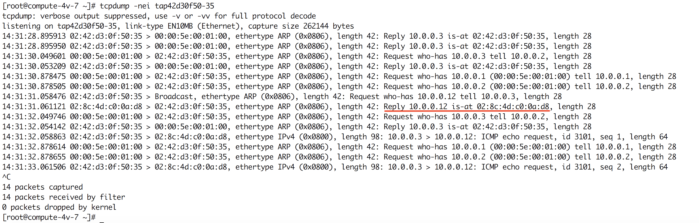

A workaround to make it work is to define the new IP@ via AAP on the vSRX_5 port.

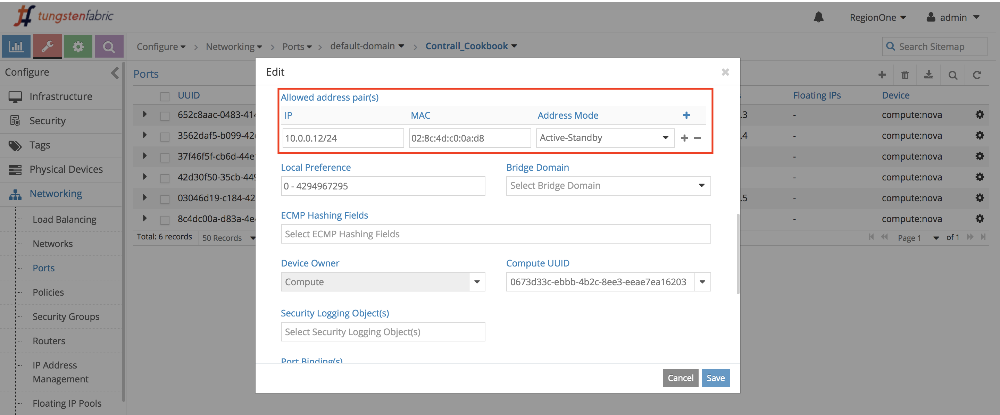

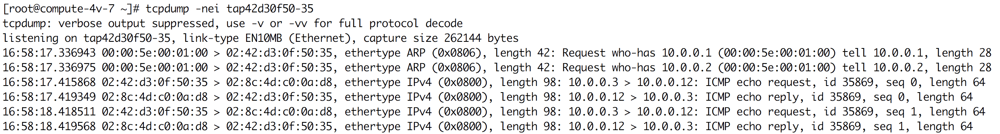

_L2-only allows this scenario without extra AAP and this is shown later._ 

##### Known IP@ but unknown Mac@

_This is a corner case and most of the time the result of bad VNF implementation._ 

Here we have manually set on vSRX_5 a new mac@ 02:8c:4d:c0:00:01 but keep initial IP@ 10.0.0.5. So as explained before, because Contrail knows the IP@ and Mac@ bindings via OpenStack, this Mac@ will be unknown.

Below we see resolution of mac@ for 10.0.0.5, but since vRouter act as proxy, it answers back with mac@ known by vRouter but it is wrong. vSRX_3 sends ping to a wrong mac@. L2-only allows this scenario and this is shown later.

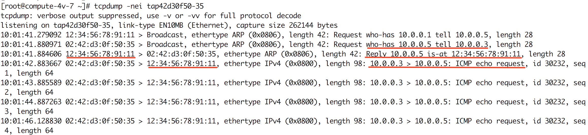

A workaround to make it work is to define the new mac@ via AAP on the vSRX_5 port.

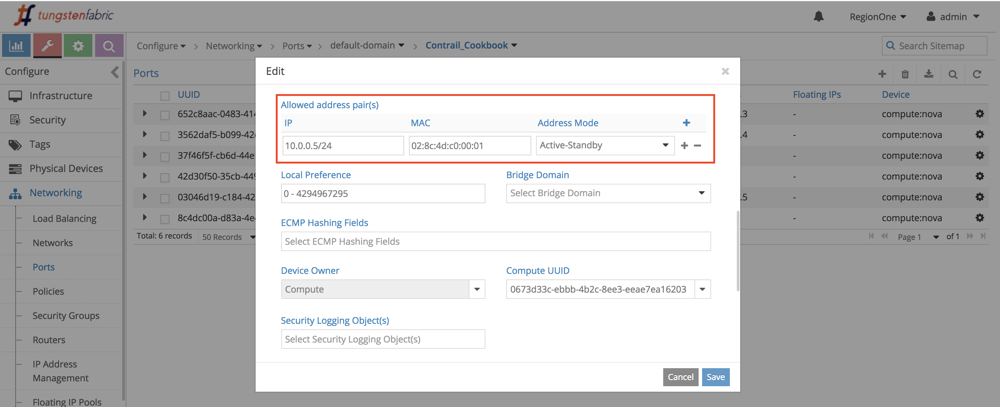

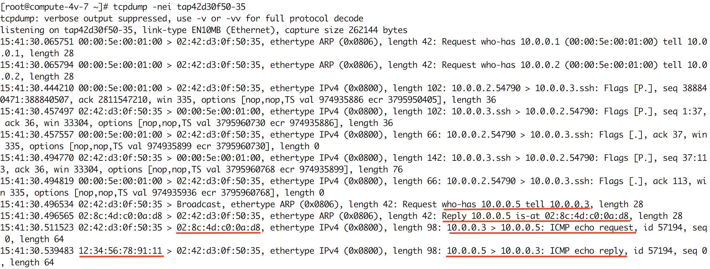

_L2-only allows this scenario without extra AAP and this is shown later._ 

#### L2 only

All traffic goes via MAC FIB lookup only.

_Note: This option is useful once we have non-IP traffic like legacy protocols in VNF (PXEboot, DHCP request to another VM, etc.)._ 

Below we can notice that the IP FIB is empty while the MAC FIB is populated.

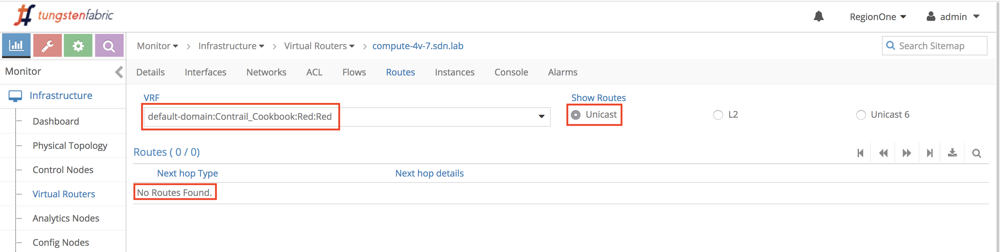

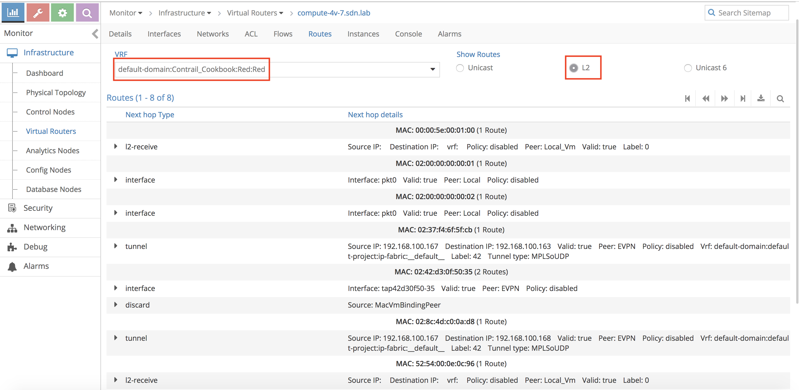

In this mode, vRouter will never answer ARP, it will flood ARP. 

Below screenshot shows on compute-4v-7.sdn.lab that vRouter has no IP to Mac@ bindings. 

Below vSRX_3 pings vSRX_4. ARP table on vSRX_3 was cleared. We notice that vSRX_3 sends an ARP request for 10.0.0.4 and vRouter broadcast the request. vSRX_4 is answering back accordingly. Besides, on vif interface we can see the flag "L2" and "F" to flood.

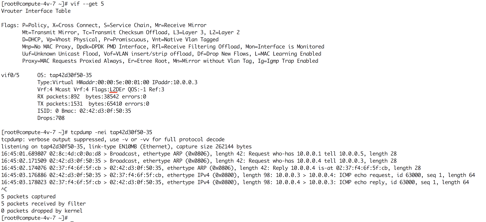

##### Unknown IP@

_This is a corner case and most of the time the result of bad VNF implementation._ 

Here we have unconfigured DHCP on vSRX_5 and manually set IP@ 10.0.0.12/32. So as explained before, because Contrail knows the IP@ and Mac@ bindings via OpenStack, this IP@ will be unknown.

Below the mac@ of IP@ 10.0.0.12/32 is resolved and ICMP packets are going through. 

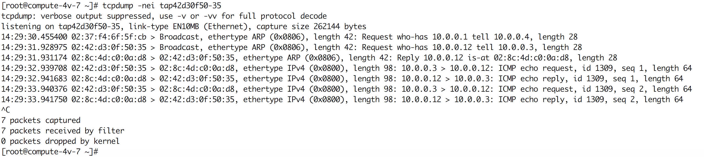

##### Known IP@ but unknown Mac@

_This is a corner case and most of the time the result of bad VNF implementation._ 

Here we have manually set on vSRX_5 a new mac@ 02:8c:4d:c0:00:01 but keep initial IP@ 10.0.0.5. So as explained before, because Contrail knows the IP@ and Mac@ bindings via OpenStack, this Mac@ will be unknown.

Below we see resolution of mac@ for 10.0.0.5 with 02:8c:4d:c0:00:01. However only ICMP echo goes through. vRouter is dropping packet since seeing an unknown mac@.

In order to make it work, need to add in the VN the knob "Flood Unknown Unicast".

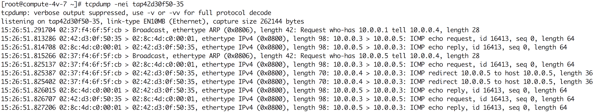

#### L3 only

All traffic goes via IP FIB lookup only.

Below we can notice that the IP FIB is populated while the MAC FIB is only having the local MAC@. 

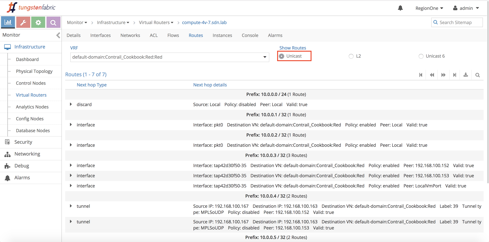

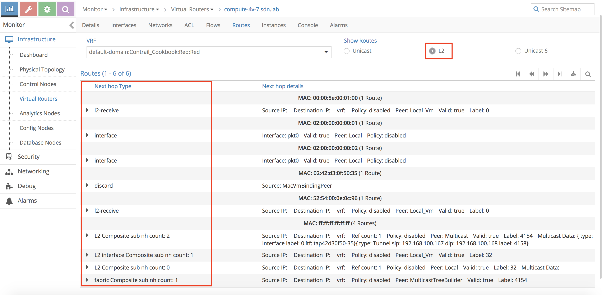

### Flood Unknown Unicast

In Contrail, all mac@ are known from OpenStack and advertised via EVPN. There is no mac-learning. Therefore, by default Contrail  will drop unknown mac@. This knob allows in corner case situation to allow it, see example [here](https://github.com/NicoJNPR/Contrail_Cookbook/blob/master/docs/index.md#known-ip-but-unknown-mac-1)  

### Reverse Path Forwarding

By default, Contrail has "Reverse Path Forwarding" knob enables in the VN. It means that vRouter checks that the source has a valid IP@ in FIB.

To demonstrate the feature, let's configure for instance a loopback 11.0.0.9/32 on vSRX_3. From vSRX_3 do ssh to vSRX_4 from this new loopback. 

Below, Reverse Path Forwarding is enabled on VN red, it shows that the compute hosting vSRX_4 is not having any ssh trace. The reason is that compute hosting vSRX_3 is dropping the packet since RPF is on. 

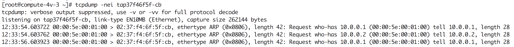

Below, Reverse Path Forwarding is now disabled on VN red, it shows that the compute hosting vSRX_4 is now having ssh trace, so it works.  

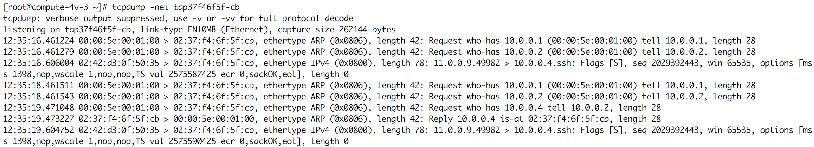

### Shared

A VN is defined for a project. It means that another project will not see this VN. 
However, sometimes it is desired that a VN is seen by all other projects (i.e. an Internet VN shared for all projects).

Below, we have a new project "Other_tenant", and we can notice there is no VN. 

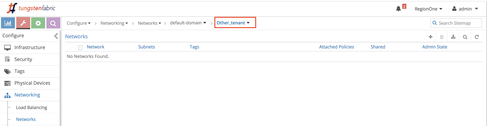

Below, after we enable shared on Red VN in Contrail_Cookbook project, we can notice the Red VN is now visible in "Other_tenant" project.

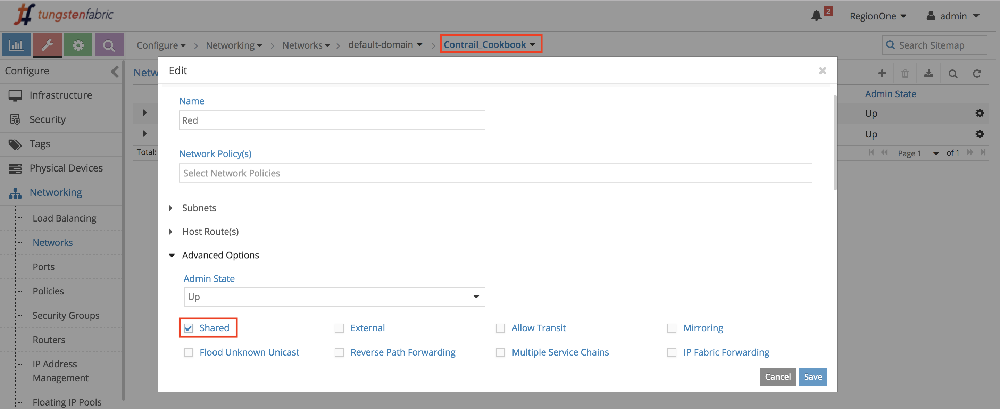

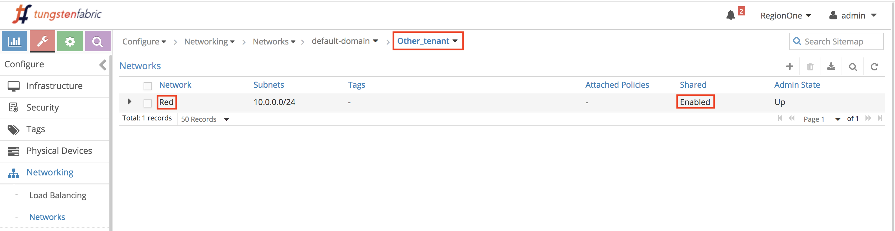

