_This Contrail_Cookbook has been written based on a [Tungsten Fabric](https://tungsten.io/) cluster, from early October 2018 trunk build (post 5.0.1) and Openstack Queens._

_Screenshots are in PNG format, so a bit heavy and therefore taking some time to load, but best quality._

Table of Contents
=================

   * [Networking](#networking)
      * [Networks (Virtual Networks)](#networks-virtual-networks)
         * [Network Policy(s)](#network-policys)
         * [Subnets](#subnets)
         * [Host routes](#host-routes)
         * [Advanced Options](#advanced-options)
            * [Forwarding Mode](#forwarding-mode)
               * [L2 and L3](#l2-and-l3)
                  * [Known IP@ and mac@](#known-ip-and-mac)
                  * [Unknown IP@](#unknown-ip)
                  * [Known IP@ but unknown Mac@](#known-ip-but-unknown-mac)
               * [L2 only](#l2-only)
                  * [Unknown IP@](#unknown-ip-1)
                  * [Known IP@ but unknown Mac@](#known-ip-but-unknown-mac-1)
               * [L3 only](#l3-only)
            * [Flood Unknown Unicast](#flood-unknown-unicast)
            * [Reverse Path Forwarding](#reverse-path-forwarding)
            * [Shared](#shared)
            * [IP Fabric Forwarding](#ip-fabric-forwarding)
            * [Allow transit](#allow-transit)
            * [Extend to Physical Router(s)](#extend-to-physical-routers)
            * [External](#external)
            * [SNAT](#snat)
            * [Mirroring](#mirroring)
            * [Multiple Service Chains](#multiple-service-chains)
            * [Static Route(s)](#static-routes)
            * [ECMP Hashing Fields](#ecmp-hashing-fields)
               * [Inside same VN](#inside-same-vn)
                  * [default](#default)
                  * [source-ip only](#source-ip-only)
               * [with SIs in scale-out (service-chaining)](#with-sis-in-scale-out-service-chaining)
            * [Security Logging Object(s)](#security-logging-objects)
            * [QoS](#qos)
            * [Provider Network](#provider-network)
            * [PBB EVPN: PBB Encapsulation, PBB ETree, Layer2 Control Word, MAC Learning, Bridge Domains](#pbb-evpn-pbb-encapsulation-pbb-etree-layer2-control-word-mac-learning-bridge-domains)
         * [DNS Server(s)](#dns-servers)
         * [Route Target(s)](#route-targets)
         * [Export Route Target(s) and Import Route Target(s)](#export-route-targets-and-import-route-targets)
         * [Import Policy](#import-policy)
         * [Fat flows](#fat-flows)
      * [Ports](#ports)
      * [Routing](#routing)
         * [Network Route Tables](#network-route-tables)
         * [Interface Route Tables](#interface-route-tables)
            * [Attaching to a port](#attaching-to-a-port)
            * [Attaching to an interface of an SI](#attaching-to-an-interface-of-an-si)
         * [Routing Policies](#routing-policies)
            * [Import routing policy on a VN](#import-routing-policy-on-a-vn)
            * [Routing Policy on a service-chain](#routing-policy-on-a-service-chain)
         * [Route Aggregates](#route-aggregates)

# Networking

In order to explain the section and all associated knobs, a Red VN with VMs have been created. 

- Red VN is having 3 VMs attached: vSRX_3, vSRX_4 and vSRX_5
- We can understand on which compute the VM runs. Besides, they all run on different computes. 

The following screenshoots show for each VM the associated IP@ and Mac@
- vSRX_3: 10.0.0.3 / 02:42:d3:0f:50:35
- vSRX_4: 10.0.0.4 / 02:37:f4:6f:5f:cb
- vSRX_5: 10.0.0.5 / 02:8c:4d:c0:0a:d8

## Networks (Virtual Networks)

### Network Policy(s)

This option allows to tie a Network Policy to a given VN (a Network Policy must have been defined before). 

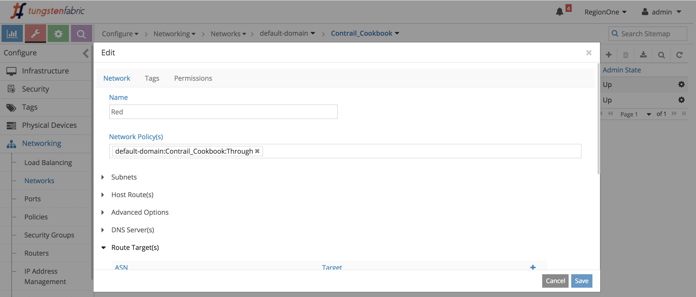

### Subnets

Each VN has a subnet. This subnet could be defined in multiple ways for the Allocation Mode. 

The most common way is "User Defined" as below. It means that the user defines himself the subnet, as below. 

* IPAM = select an IPAM, it has to be pre-defined before. 
* CIDR = CIDR type of prefix.
* Allocation pools = can be blank (first address will be .3) or specify a start & end address. 
* Gateway = GW IP@ will auto-populated by Contrail with x.x.x.1 address or could be manually specified. 
* Service Address = used for metadata service (vRouter DHCP and DNS messages to VM) with x.x.x.2 address by default or could be manually specified. 
* DNS = enable DNS to provide DNS parameters that were specified in IPAM. If nothing specified, the service address of the subnet is used as the DNS server.
* DHCP = enable DHCP in the VN to provide IP@ to VMs along other DHCP options, so vRouter traps DHCP message coming from VM. If DHCP is disabled in the subnet, the broadcast DHCP requests will be flooded in the VN.

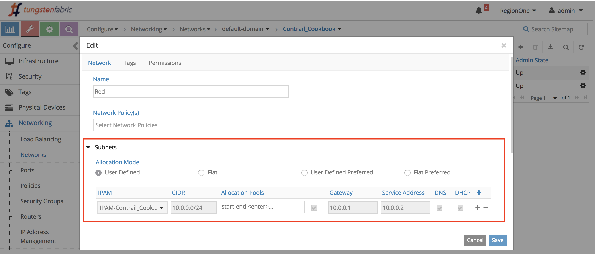

### Host routes

“Host Route” is a way to pass a route to the VM. It is passed via vRouter DHCP offer to the VM, and therefore it is installed into the VM routing table. However, Host routes are not visible into Contrail routing tables. 

Below how to configure it and then result on a Cirros VM.

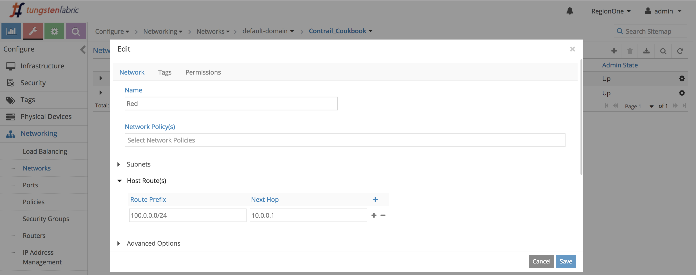

### Advanced Options

#### Forwarding Mode
Contrail supports 3 forwarding modes: L2 and L3, L2 only and L3 only. Note that default option means L2 and L3.

This can be set on a per VN basis, see below.

In next sections, we will focus:
- only on "Red" VN
- from compute-4v-7.sdn.lab that is hosting vSRX-3

Contrail is "Configuration based Learning": configuration for a virtual-machine-interface contains both IP address and MAC address for the interface. For virtual-machines spawned on a compute node, the vrouter will learn IP to MAC address binding from the configuration (Contrail does not perform mac-learning). The MAC binding information is exported in EVPN Routes to the Control Node.

VRouter behavior on receiving an ARP Request (from VM to vRouter):

    Do Inet route lookup for the IP Destination
    If Route found for the IP Destination
        If Proxy Flag set in the route
            If MAC Stitching information present in the route
                Send ARP Respone with the MAC present in stitching information
            Else // MAC Stitching not found
                If Flood Flag set in the route
                    Flood the ARP packet
                Else // PROXY set, No-Flood, No-MAC Stitching
                    Send ARP response with VRouter MAC address
        Else // Proxy Flag not set
            If Flood flag set in the Route
                Flood the ARP packet
            Else // Proxy Not set, Flood not set
                Drop the packet
    Else // Route not found
        Flood the ARP

_Note: ARP processing is greatly further detailed [here](https://github.com/Juniper/contrail-controller/wiki/Contrail-VRouter-ARP-Processing)_

##### L2 and L3

In this mode IPv4 traffic lookup is done via IP FIB and all non IPv4 traffic is directed to MAC FIB.

This is the default option and should be used unless having a specific requirement.

In below screenshot, it is worth mentioning that since we are on _compute-4v-7.sdn.lab_ that is hosting vSRX-3, 10.0.0.3/32 has local tap-interface, while for instance 10.0.0.4/32 has tunneling via MPLSoUDP since being on another compute. Simiraly, 02:42:d3:0f:50:35 has local tap-interface while for instance 02:37:f4:6f:5f:cb has tunneling via MPLSoUDP since being on another compute.

###### Known IP@ and mac@

Below screenshot shows on _compute-4v-7.sdn.lab_ that vRouter has associated 10.0.0.4 to 02:37:f4:6f:5f:cb. It has "P" in flag to say "Proxy ARP".

Below vSRX_3 pings vSRX_4 (ARP table on vSRX_3 was cleared). We notice that vSRX_3 sends an ARP request for 10.0.0.4 and **vRouter** will answer (on behalf of vSRX_4, so acting as proxy ARP) the ARP request thanks to mac@ known above. Besides, on vif interface we can see the flag "L3L2".

###### Unknown IP@

_This is a corner case and most of the time the result of bad VNF implementation._ 

Here we have unconfigured DHCP on vSRX_5 and manually set IP@ 10.0.0.12/32. So as explained before, because Contrail knows the IP@ and Mac@ bindings via OpenStack, this IP@ will be unknown.

Below the mac@ of IP@ 10.0.0.12/32 is resolved (but ARP request is not proxy by vRouter but flooded and answered by vSRX_5 itself). ICMP packets are dropped since unknown IP@.

A workaround to make it work is to define the new IP@ via AAP on the vSRX_5 port.

_L2-only allows this scenario without extra AAP and this is shown later._ 

###### Known IP@ but unknown Mac@

_This is a corner case and most of the time the result of bad VNF implementation._ 

Here we have manually set on vSRX_5 a new mac@ 12:34:56:78:91:11 but keep initial IP@ 10.0.0.5. So as explained before, because Contrail knows the IP@ and Mac@ bindings via OpenStack, this Mac@ will be unknown.

ARP cache table cleared on both vSRX_3 and vSRX_5.

Below we see resolution of mac@ for 10.0.0.5 from compute 7 hosting vSRX_3. vRouter acts as a proxy and answers back with the known mac@ 02:8c:4d:c0:0a:d8. The ICMP echo request is sent to 02:8c:4d:c0:0a:d8, no reply comes back. 

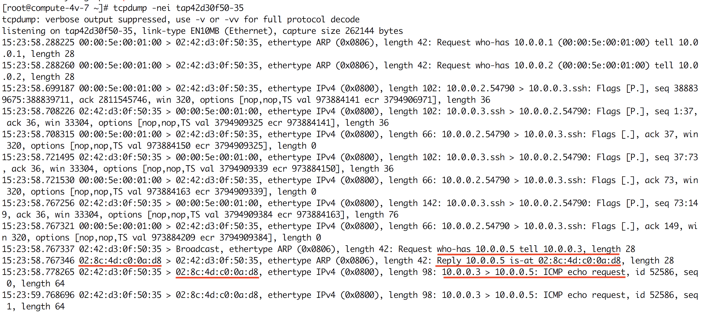

Below it is from compute 8 hosting vSRX_5. First of all, it proves that the arp request has been intercepted by vrouter on compute 7 since no arp request from vSRX_3. Then we notice the ICMP echo request, but no reply. vSRX_5 is sending arp request for vSRX_3 but with an unknown mac address as source, so vRouter never replies. 

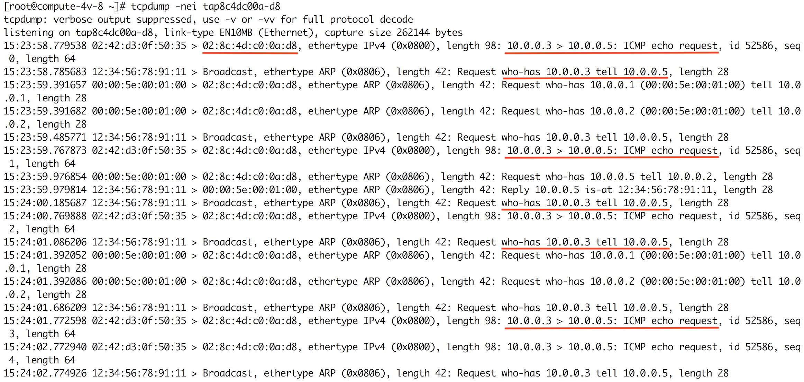

A workaround to make it work is to define the new mac@ via AAP on the vSRX_5 port. ARP cache table cleared on both vSRX_3 and vSRX_5.

Below, the sequence on compute 7 hosting vSRX_3 is same as before. vRouter acts as a proxy and answers back with the known mac@ 02:8c:4d:c0:0a:d8. The ICMP echo request is sent to dest mac@ 02:8c:4d:c0:0a:d8, and this time it has echo reply but with source mac@ 12:34:56:78:91:11. 

Below it is from compute 8 hosting vSRX_5. First of all, it proves that the arp request has been intercepted by compute 7 since no arp request from vSRX_3. vSRX_5 is sending arp request for vSRX_3 and with source mac@ 12:34:56:78:91:11, and vRouter act as proxy and this time answering back the ARP request. Then vSRX_5 is sending the echo reply with source mac@ 12:34:56:78:91:11.

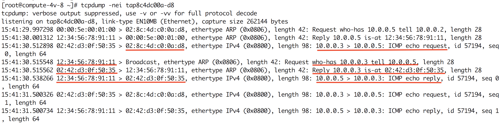

_Note: L2-only allows this scenario without extra AAP and this is shown later._ 

##### L2 only

All traffic goes via MAC FIB lookup only.

_Note: This option is useful once we have non-IP traffic like legacy protocols in VNF (PXEboot, DHCP request to another VM, etc.)._ 

_Note: In L2-only VN it is best practice to disable in IPAM subnet settings DHCP, and set at 0.0.0.0 DNS and GW IP@_

###### Known IP@ and mac@

Below we can notice that the IP FIB is empty while the MAC FIB is populated.

In this mode, vRouter will never answer ARP, it will flood ARP. 

Below screenshot shows on compute-4v-7.sdn.lab that vRouter has no IP to Mac@ bindings. 

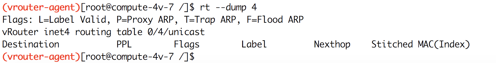

Below vSRX_3 pings vSRX_4. ARP table on vSRX_3 was cleared. We notice that vSRX_3 sends an ARP request for 10.0.0.4 and vRouter broadcast the request. vSRX_4 is answering back accordingly. Besides, on vif interface we can see the flag "L2".

###### Unknown IP@

_This is a corner case and most of the time the result of bad VNF implementation._ 

Here we have unconfigured DHCP on vSRX_5 and manually set IP@ 10.0.0.12/32.

Below the mac@ of IP@ 10.0.0.12/32 is resolved and ICMP packets are going through. 

###### Known IP@ but unknown Mac@

_This is a corner case and most of the time the result of bad VNF implementation._ 

PLEASE IGNORE THIS SECTION, THERE MISTAKES, BEING UPDATED.

Here we have manually set on vSRX_5 a new mac@ 12:34:56:78:91:11 but keep initial IP@ 10.0.0.5. So as explained before, because Contrail knows the IP@ and Mac@ bindings via OpenStack, this Mac@ will be unknown.

ARP cache table cleared on both vSRX_3 and vSRX_5.

Below it is from compute 7 hosting vSRX_3. vSRX_3 sends an arp request for vSRX_5 IP@. It is flooded and get request back with the new mac@ 12:34:56:78:91:11. vSRX_3 sends ICMP echo request, but no reply.  

Below it is from compute 8 hosting vSRX_3. We notice the arp request from vSRX_3 and it replies from vSRX_5. However, no ICMP echo request coming in, they are dropped on vRouter compute 7 since unknown mac@ traffic.  

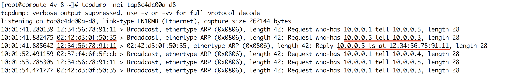

In order to make it work, need to add in the VN the knob "Flood Unknown Unicast". ARP cache table cleared on both vSRX_3 and vSRX_5.

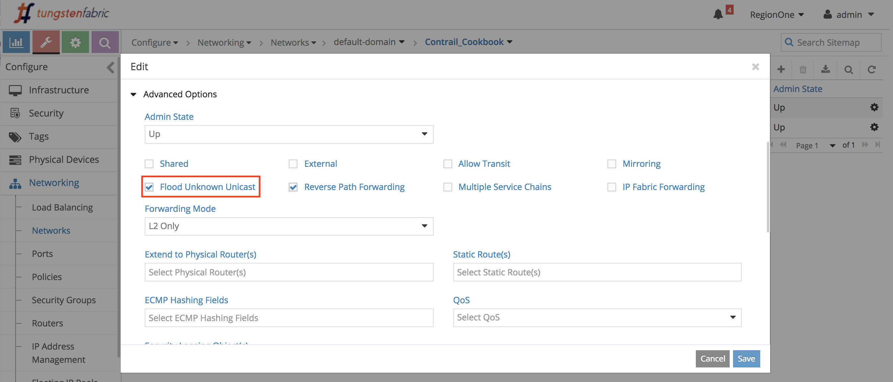

Below it is from compute 7 hosting vSRX_3. vSRX_3 sends an arp request for vSRX_5 IP@. It is flooded and get request back with the new mac@ 12:34:56:78:91:11. vSRX_3 sends ICMP echo request and now gets reply.

##### L3 only

All traffic goes via IP FIB lookup only.

Below we can notice that the IP FIB is populated while the MAC FIB is only having the local MAC@. 

#### Flood Unknown Unicast

In Contrail, all mac@ are known from OpenStack and advertised via EVPN. There is no mac-learning. Therefore, by default Contrail  will drop unknown mac@. This knob allows in corner case situation to allow it, see example [here](https://github.com/NicoJNPR/Contrail_Cookbook/blob/master/docs/index.md#known-ip-but-unknown-mac-1)  

#### Reverse Path Forwarding

By default, Contrail has "Reverse Path Forwarding" knob enables in the VN. It means that vRouter checks that the source has a valid IP@ in FIB. Note that it only works for inter-subnet IP@, not intra-subnet IP@.

To demonstrate the feature, let's configure for instance a loopback 11.0.0.9/32 on vSRX_3. From vSRX_3 do ssh to vSRX_4 from this new loopback. 

Below, Reverse Path Forwarding is enabled on Red VN, it shows that the compute hosting vSRX_4 is not having any ssh trace. The reason is that compute hosting vSRX_3 is dropping the packet since RPF is on. 

Below, Reverse Path Forwarding is now disabled on VN red, it shows that the compute hosting vSRX_4 is now having ssh trace, so it works.  

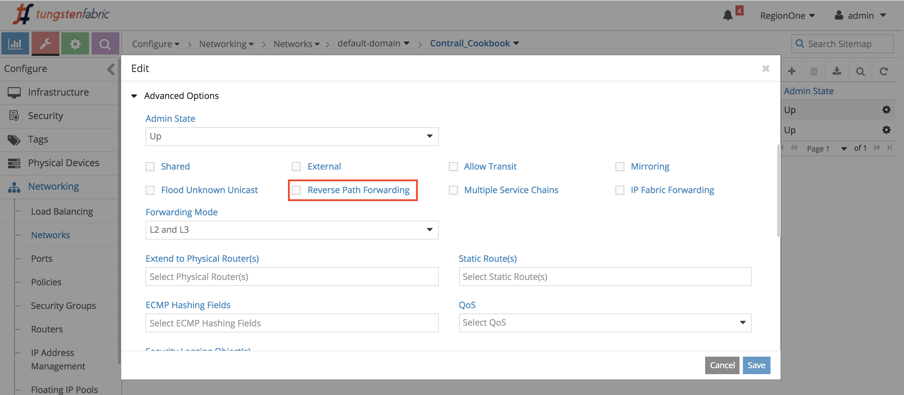

#### Shared

A VN is defined for a project. It means that another project will not see this VN. 
However, sometimes it is desired that a VN is seen by all other projects (i.e. an management-VN shared for all projects).

Below, we have a new project "Other_tenant", and we can notice there is no VN. 

Below, after we enable shared on Red VN in Contrail_Cookbook project, we can notice the Red VN is now visible in "Other_tenant" project.

#### IP Fabric Forwarding

This feature enables to connect a VN directly to the underlay (aka Fabric). It will leak the VN routes to the underlay routing instance. This is to allievate the need of an SDN GW, but at the cost of loosing the overlay benefits and with native MPLS integration with the backbone. 

Below shows the "Fabric" underlay routing instances. We can notice prefix with 192.x.x.x but none with 10.x.x.x that we use in Red VN.

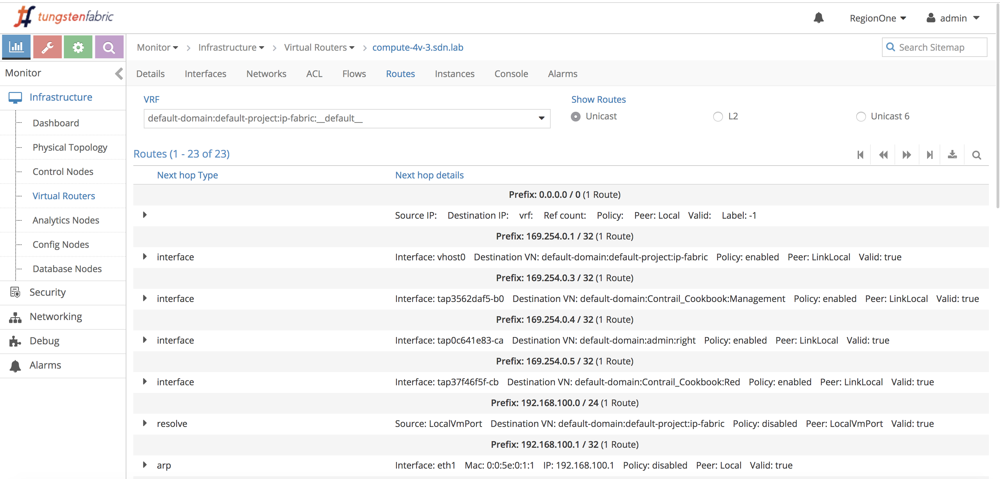

Below shows how to enable "IP Fabric Forwarding".

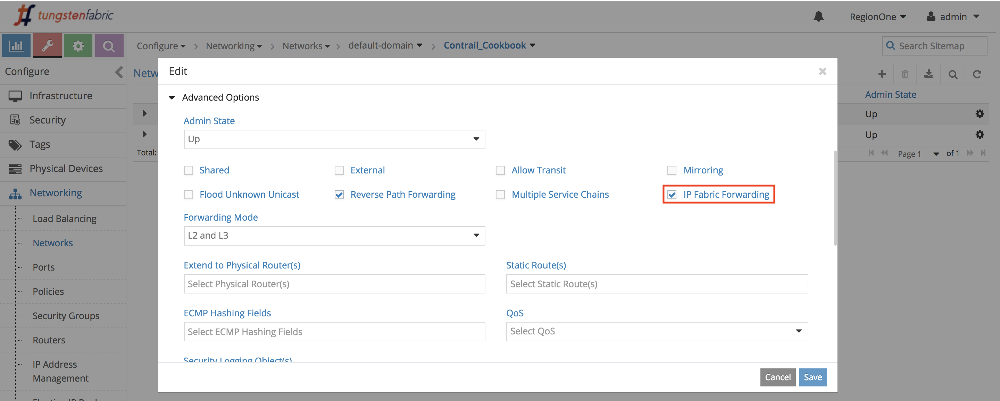

Below shows that now Red VN routes are also present in the "Fabric" underlay routing instance.

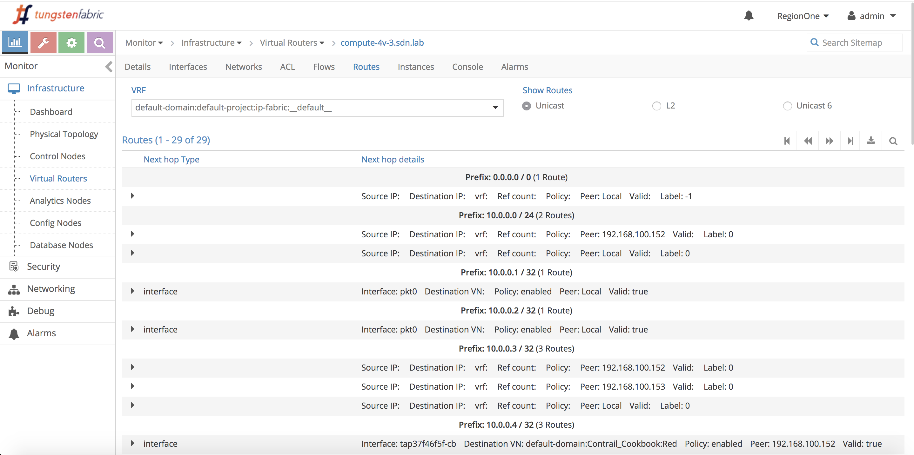
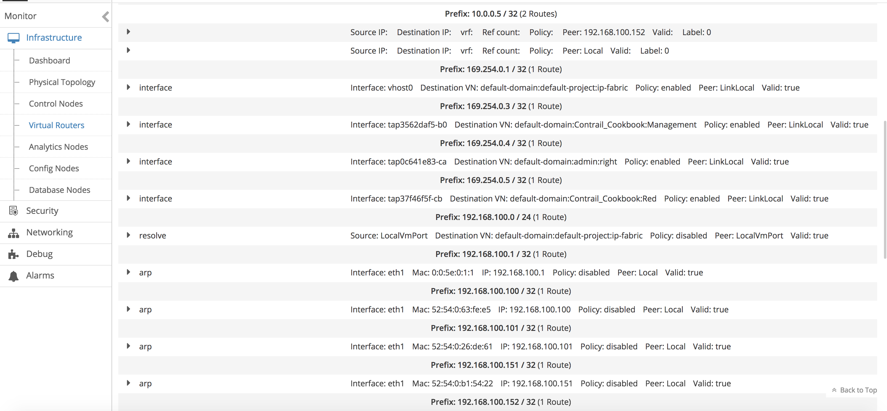

Also, the Red VN now has a default route to underlay.

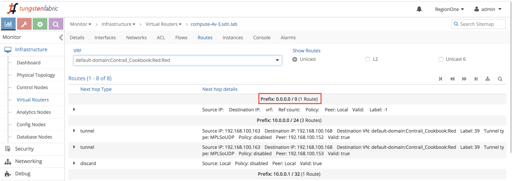

Finally, in order to make it work, we need to create a policy to allow traffic from Red VN to Fabric and apply it to Red VN network. 

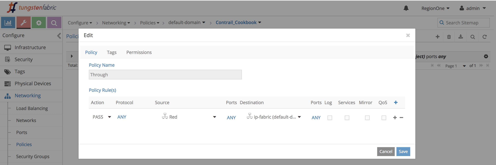

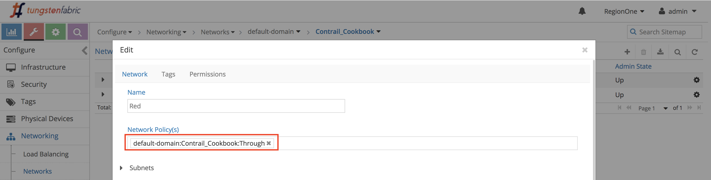

Below shows a ping from vSRX_4 having 10.0.0.4 to an underlay device having 192.168.100.151. It is eth1 interface, so egressing straight to the underlay (there is no ICMP reply because no routes in underlay to 10.0.0.4)

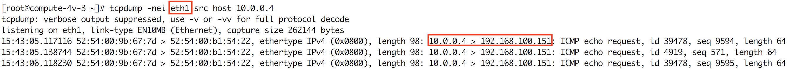

#### Allow transit

Allow transit enables to readvertise service-chain routes from a VN to another service-chain. Note that a VN cannot be connected directly to a transit VN.

The use case is VNLeft----SI1----VNmiddle-----SI2-----VNRight. This assumes being familiar with Contrail service-chaining (ST, SI, policy, etc.). 

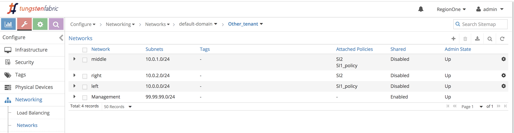

So routes from VN right will by default be readvertised to VN middle as per service-chaining. However, they won't be readvertised to VNleft, see below.

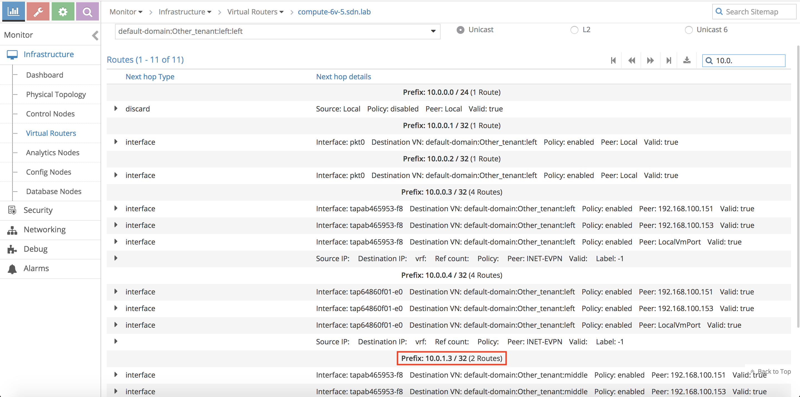

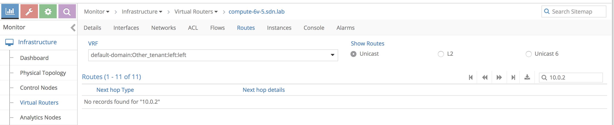

However, if we enable "allow transit" on VN middle, VN Right routes in VN middle will be readvertised to VN Left (and vice-versa from Left to Right). 

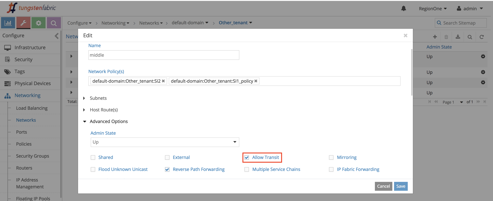

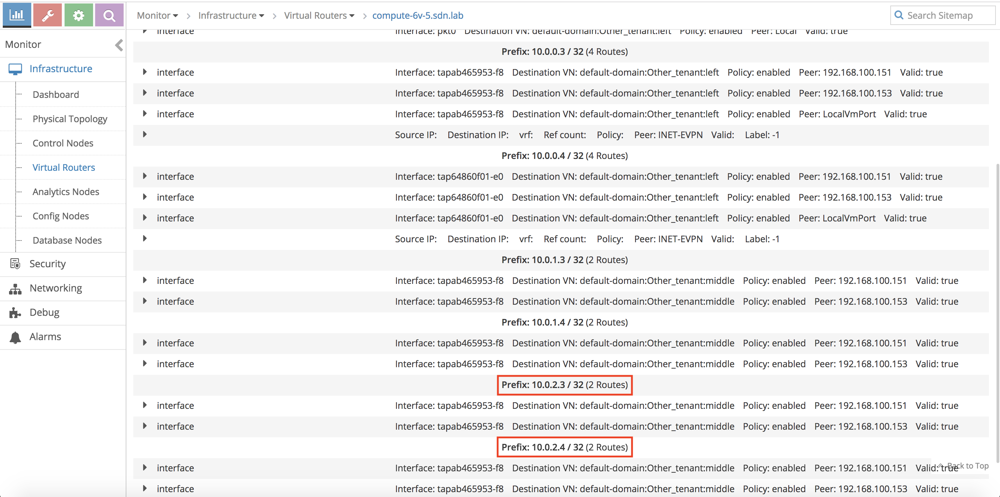

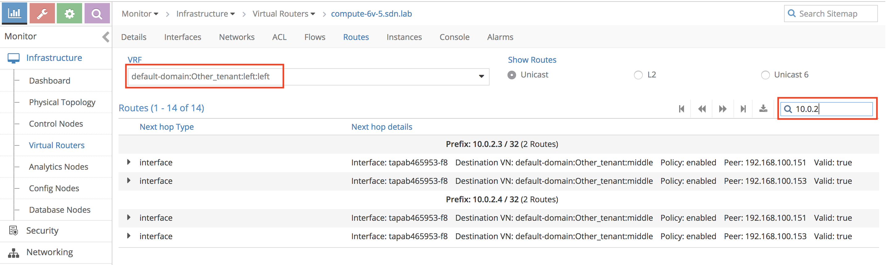

#### Extend to Physical Router(s)

It is relevant only if Device-Manager is used. In such a case, if it is enabled, it pushes Junos config to MX to extend the VN to the MX SDN GW (RT, policies, etc.).

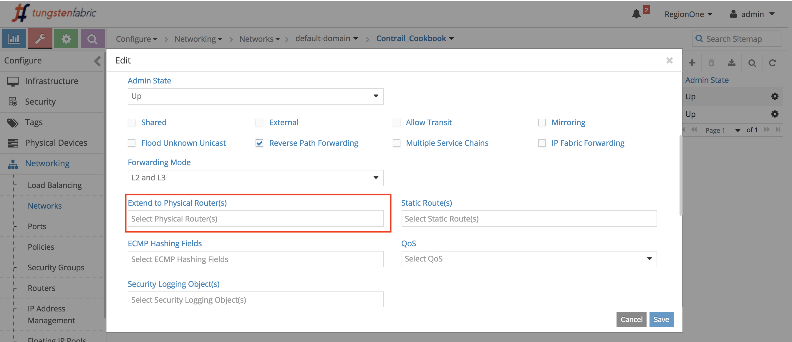

#### External

It is relevant only if Device-Manager is used. In such a case, if it is enabled, it pushes Junos config to MX with adding a default route to make it "public". 

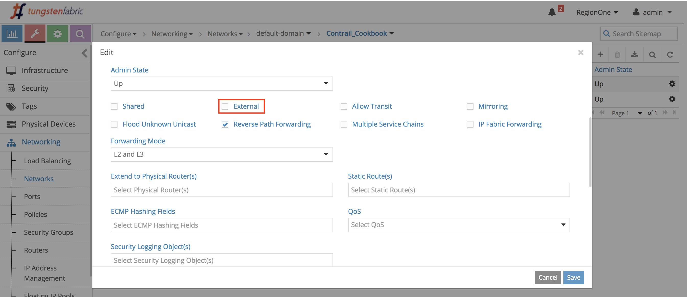

#### SNAT

TBC

#### Mirroring

TBC

#### Multiple Service Chains

TBC

#### Static Route(s)

It enables to attach a static route of "Network Route Tables" type. See Routing section for details.

#### ECMP Hashing Fields

By default, Contrail uses a 5-tuples for hashing during ECMP load balancing. 

The 5-tuples is standard and as follow: Source L3 address, Destination L3 address, L4 protocol, L4 SourcePort and L4 DestinationPort.

On a per VN basis, we can modify the tuple for the hash.

##### Inside same VN

To demonstrate the feature, we use the 3 vSRX in the Red VN. 

vSRX_4 and vSRX_5 have been configured with same loopback 7.7.7.7/32. An Interface Route table (see corresponding section for details) was created accordingly on both ports of vSRX_4 and vSRX_5.

vSRX_4 has mac@ 02:37:f4:6f:5f:cb

vSRX_5 has mac@ 02:8c:4d:c0:0a:d8

vSRX_3 will be used as initiator of ssh traffic. Two ssh connections will be issued sequentially from two terminals on vSRX_3.

###### Default

Below we see that ECMP hashing field is empty, so inheriting the global conf (that is 5-tuple).

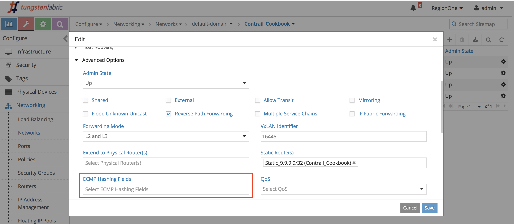 

Below is a TCPdump of the vSRX_3 VMI. We can notice that two ssh sessions were initiated, and each got loadbalanced to both vSRX (mac@ are different).

 

###### Source-ip only

Below we see that ECMP hashing field is now with source-ip.

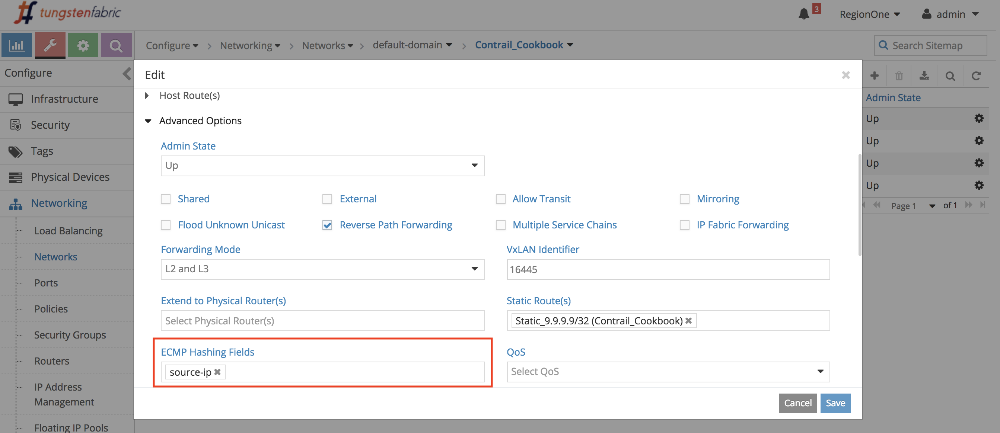 

Below is a TCPdump of the vSRX_3 VMI. We can notice that two ssh sessions were initiated and each time vSRX_5 that has mac@ 02:8c:4d:c0:0a:d8 answered (same test was repeated with many connections for verification purpose)

##### With SIs in scale-out (service-chaining) 

#### Security Logging Object(s)

Security events including traffic session ACCEPTs and DROPs due to enforcement of policy and security groups have to be logged to Analytics, this is the purpose of Security Logging Object (SLO).

It is defined in Global Config and can be applied on a per VN basis as below. 

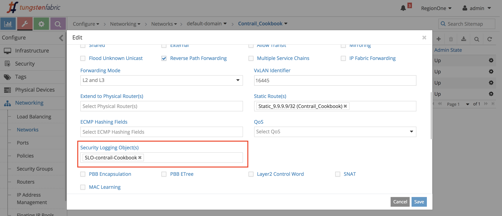 

#### QoS

TBC

#### Provider Network

This knob enables to map a VN to a NIC via SR-IOV. Note that it can only be enabled if no VM running on the VN.

It assumes that SR-IOV has been properly configured upfront (VF function on the NIC, etc.). Further detailed [here](https://www.juniper.net/documentation/en_US/contrail5.0/topics/concept/sriov-with-vrouter-vnc.html#jd0e177) 

On the VN, need to specify the Provider Network with information defined in SR-IOV configuration on the host.

 

Then need to create a port tied to the VN as below. The value field must have "direct" as input. 

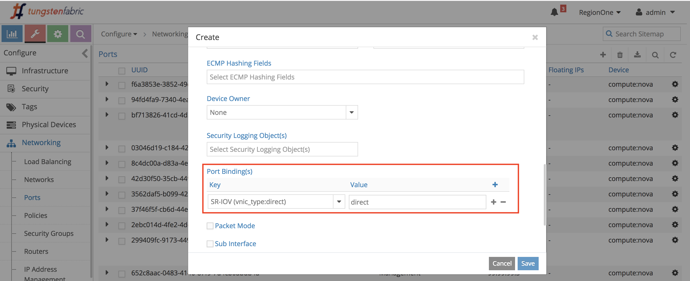 

Using the UUID of the Neutron port you created, use the nova boot command to launch the VM from that port.
nova boot --flavor m1.large --image <image name> --nic port-id=<uuid of above port> <vm name>

#### PBB EVPN: PBB Encapsulation, PBB ETree, Layer2 Control Word, MAC Learning, Bridge Domains

For a very particular scenario, PBB EVPN has been developed on Contrail. 

Specification is [here](https://github.com/Juniper/contrail-specs/blob/master/pbb_evpn.md).

Below the UI knobs related to PBB EVPN (not explained).

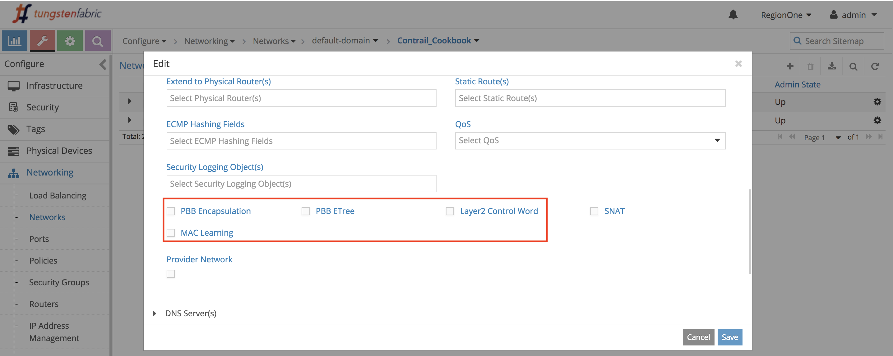 

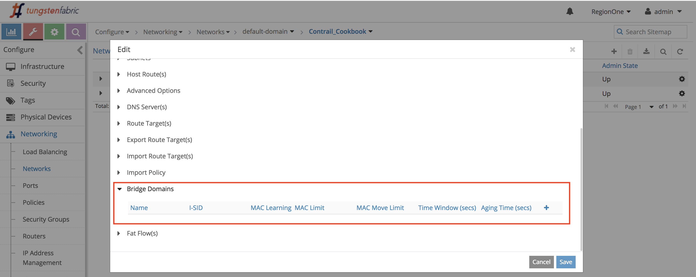 

### DNS Server(s)

This option allows to pass DNS IP@ to the VMs via DHCP for a given VN. 

Below we are setting for Red VN 8.8.8.8 as DNS IP@. Then we connect on a Cirros image to show that it is applied.

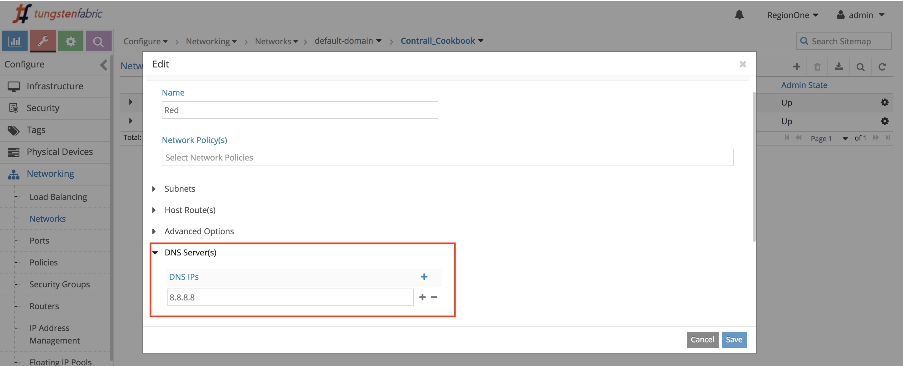 

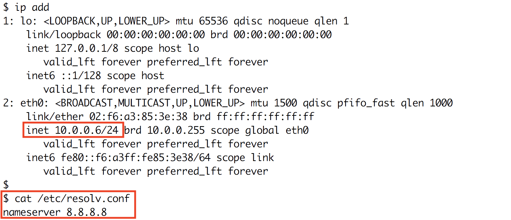 

### Route Target(s)

This option allows to specify a specific RT for a VN. Note that Contrail automatically set a RT for a VN. 

Below it shows Red VN with its RT auto set by Contrail. 

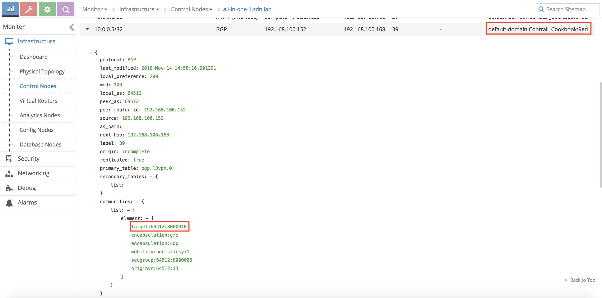 

Below it shows how to add a specific RT (in addition to the Contrail auto-generated one) and the result.

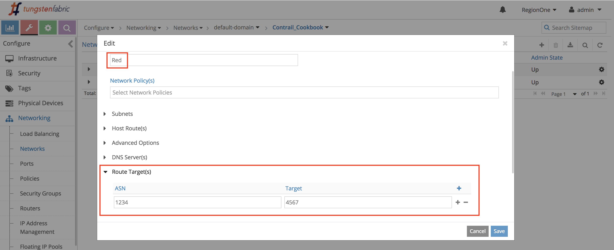 

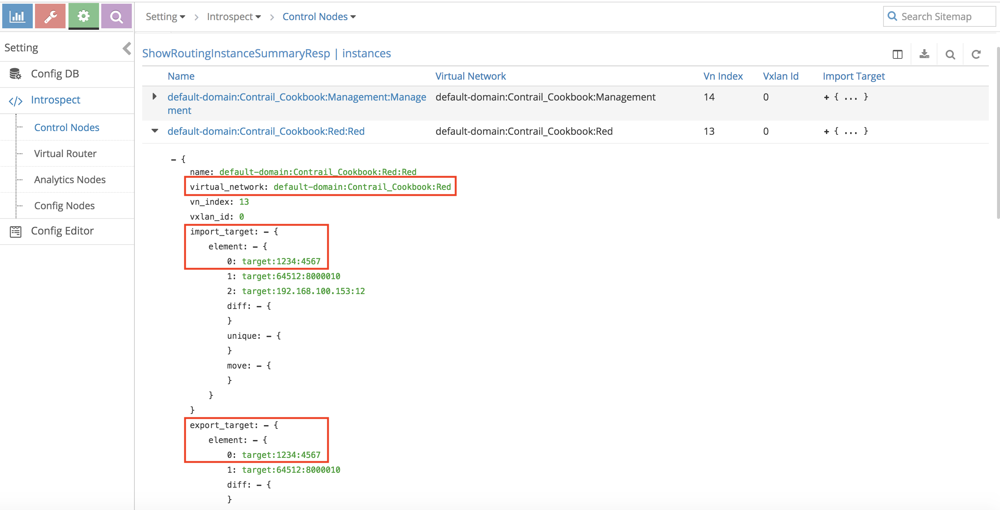 

We can also look a given route in Red VN to notice the RT (only export)

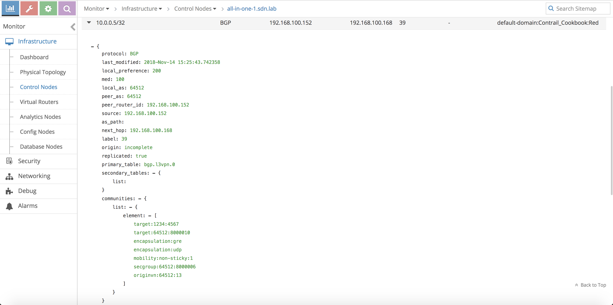 

### Export Route Target(s) and Import Route Target(s)

Unlike previous feature that easily make symmetric RT and which is a common use case, we can have asymmetric RTs for a VN.

Below it shows how to add an asymmetric RT (in addition to the Contrail auto-generated one) and the result. We use introspect to both see import and export.

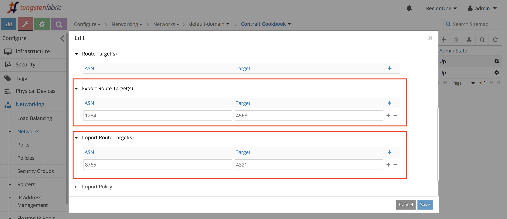 

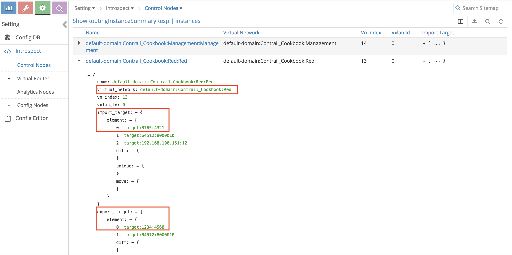 

### Import Policy

An import policy allows to refer to a routing policy. Basically, it enables to manipulate routes into the VN (add/remove community, LP, MED, reject, etc.). If the VN is extended to an SDN GW, it will inherit the manipulation (meaning an LP set on a route in a VN, it will get this particular LP into the VRF of the SDN GW).  

_Routing Policy are further described in relevant section._ 

### Fat flows

TBC

## Ports

## Routing

### Network Route Tables

It allows to create a "static" route with a _next-hop_ into a VN. Note that we can set a community of our choice or select a well-known community or both. 

We created in vSRX_4 a new loopback 9.9.9.9/32.

Below first we need to create a static route 9.9.9.9/32 and we set as next-hop 10.0.0.4 which represents vSRX_4. 

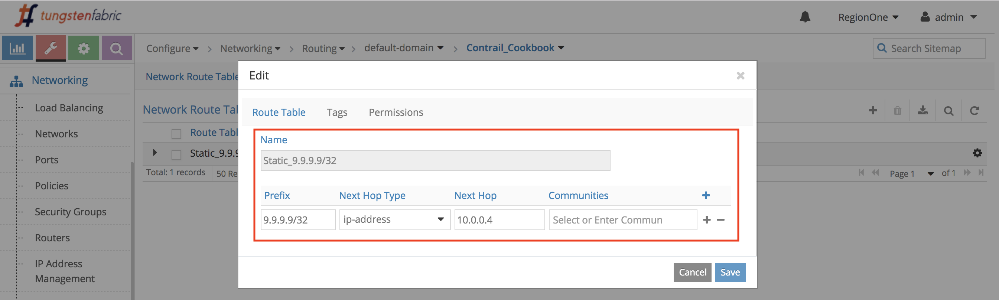 

Then we need to apply it to the Red VN.

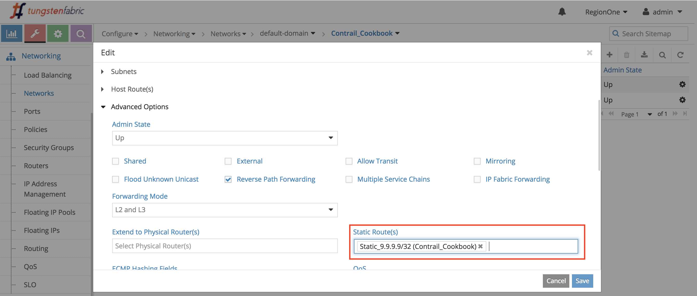 

Below is the CN point of view for the 9.9.9.9/32 routes. The 192.168.100.163 next-hop is the vRouter address hosting vSRX_4.

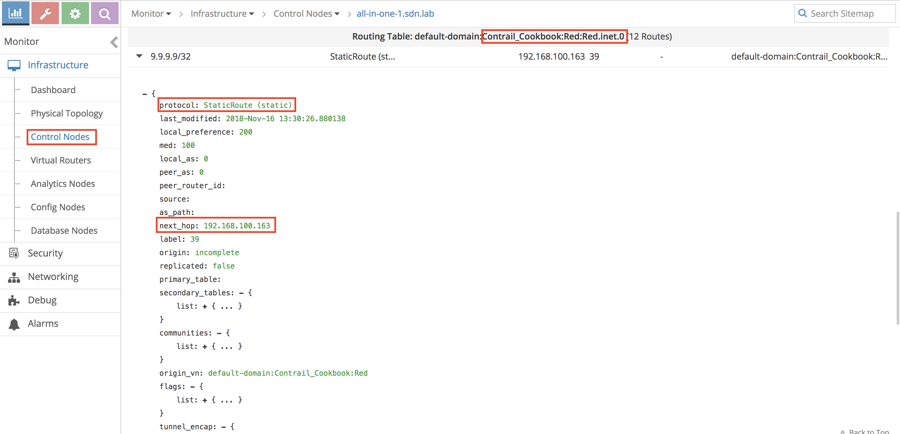 

Below is the vRouter hosting vSRX_4 point of view for the 9.9.9.9/32 routes

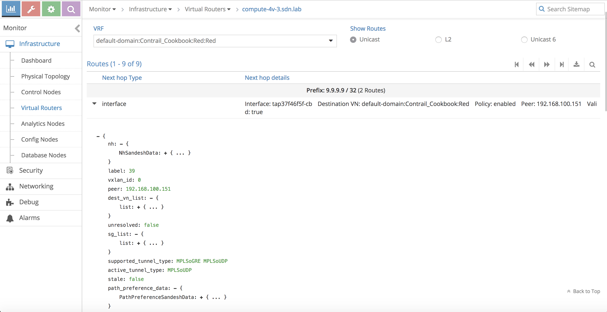 

Below finally we issue a successful ping from vSRX_3 to vSRX_4 new 9.9.9.9/32 loopback.

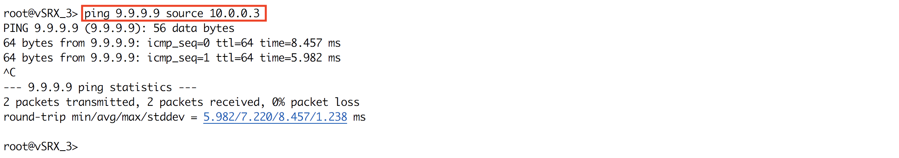 

### Interface Route Tables

It allows to create a "static" route _without a next-hop_ since tied to a port (VMI). Note that we can set a community of our choice or select a well-known community or both. 

It can be attached either to a port (VMI) or to an interface of an SI (service-chain).

We created in vSRX_4 a new loopback 7.7.7.7/32.

Below first we need to create a static route 7.7.7.7/32. We also take the opportunity to add a community and a well-known-community.  

#### Attaching to a port

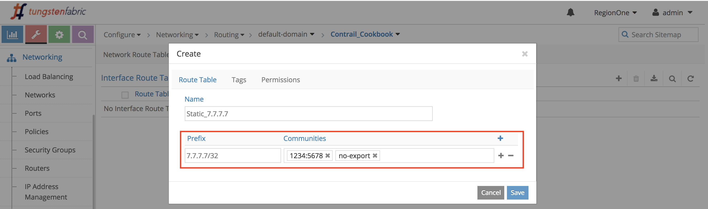 

Then we need to apply it to a Port (VMI)

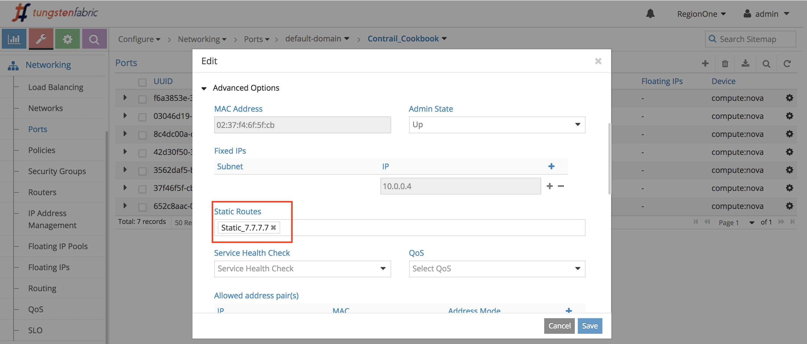 

Below is the CN point of view for the 7.7.7.7/32 routes. The 192.168.100.163 next-hop is the vRouter address hosting vSRX_4.

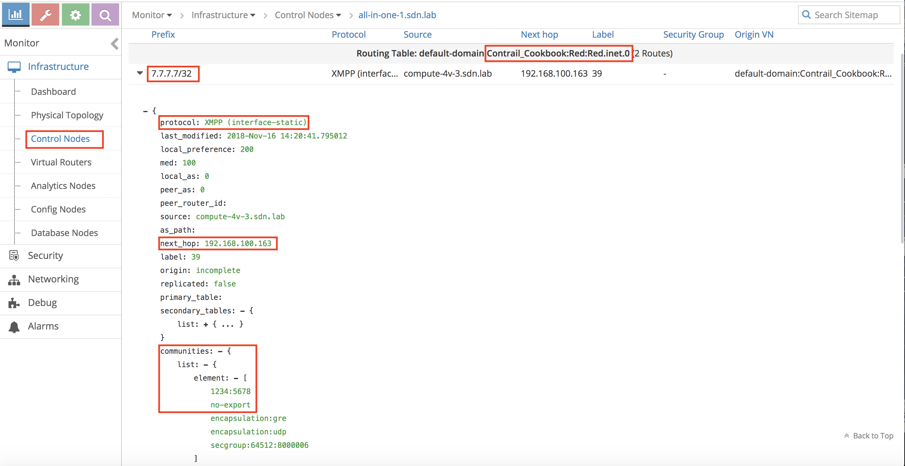 

Below is the vRouter hosting vSRX_4 point of view for the 7.7.7.7/32 routes

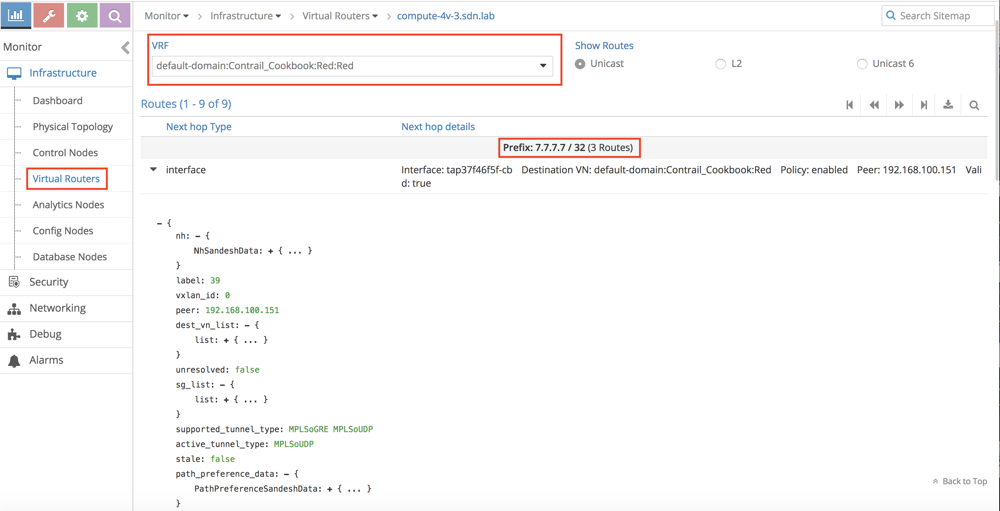 

Below finally we issue a successful ping from vSRX_3 to vSRX_4 new 7.7.7.7/32 loopback.

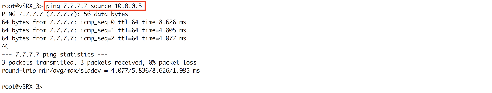.

Note that it can be attached to multiple ports. It will create routes accordingly (added the 7.7.7.7 route to vSRX_5 port. vSRX_5 is on compute-4v-8.sdn.lab), see below.

.

#### Attaching to an interface of an SI

Below it shows how to attach to an interface of an SI. The rest is same as before.

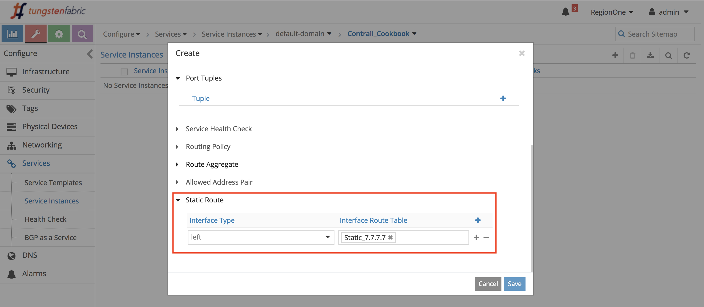 

### Routing Policies

Routing policies are very powerful.

For illustration purpose, we will also show the results on an MX SDN GW that already have the necessary peering to Contrail cluster.  

As usual, order matters in policy.

We can match on community, protocol and prefix. 

On protocol, we have type and subtype as follow:
* XMPP
	* interface (vmi)
	* interface-static (Interface Route Tables)
* Static (Network Route Tables)
* BGP
	* BGPaaS
* Service-chain
	* service-interface
* Aggregate

They can be applied either on a VN or on a service-instance (service-chain).

#### Import routing policy on a VN

In Red VN we can see the routes and corresponding protocol type/subtype.

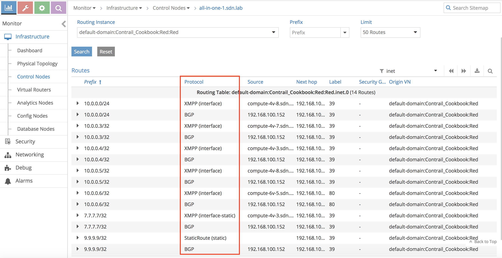 

The following policy has been defined. 

 

 

It is then applied to Red VN.

 

Below it shows 10.0.0.4 routes to illustrate the xmpp manipulation.

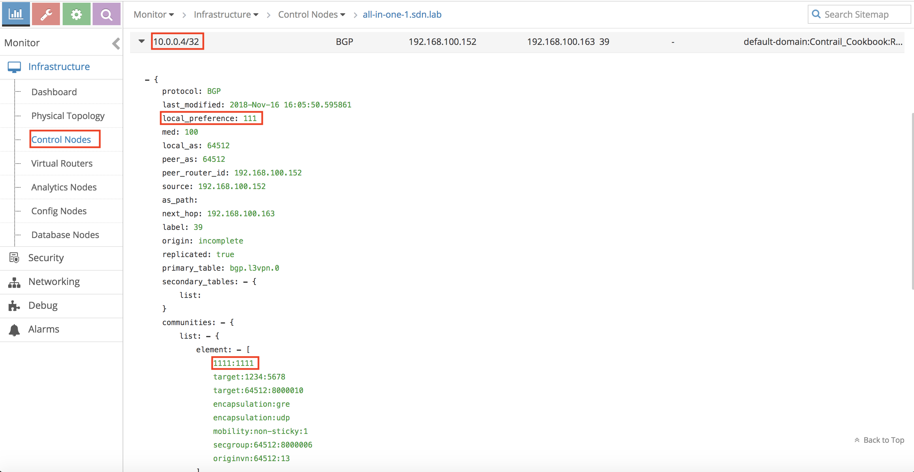 

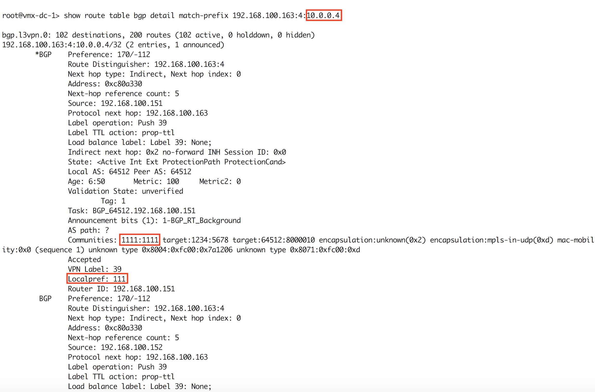 

Below it shows 7.7.7.7 routes to illustrate the static-interface (Interface-Route-Tables) manipulation.

 

 

Below it shows 9.9.9.9 routes to illustrate the static (Network-Route-Tables) manipulation.

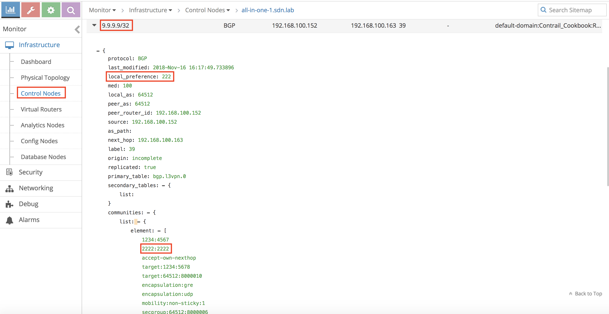 

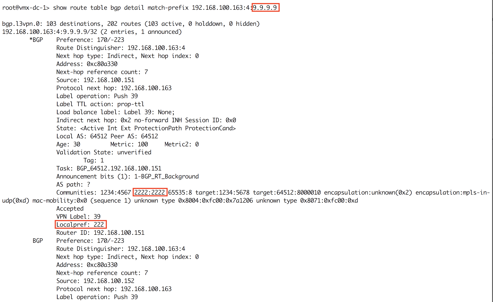 

To show the type and subtype, if we only match on type "xmpp", only routes previously seen are now having set the community and LP set accordingly. 

TO ADD - TBC

#### Routing Policy on a service-chain

We now have a service-chain as follow: red_VN----SI----blue_VN.
Blue_VN subnet is 31.0.0.0/24.
SI is having left with 10.0.0.7 and right with 31.0.0.4.
A VM in blue is having 31.0.0.3.

In Red VN, we now have the blue VN routes. We can notice the protocol type. 

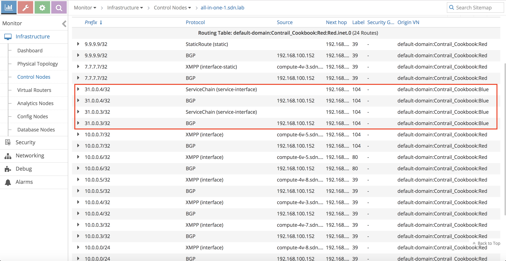 

The following Routing Policy is defined and attached to SI as below. Note that in order to get the policy effective for left network (so routes from right to left), need to apply it on SI left interface.

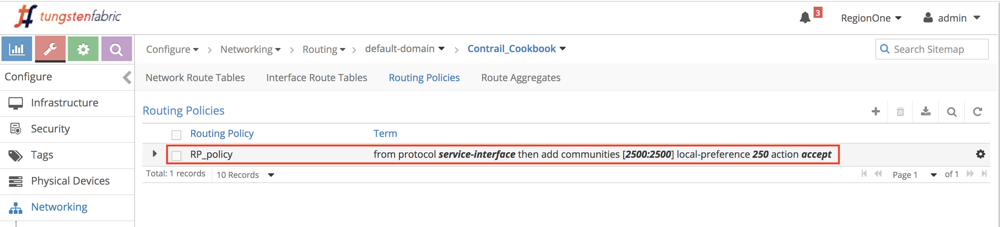

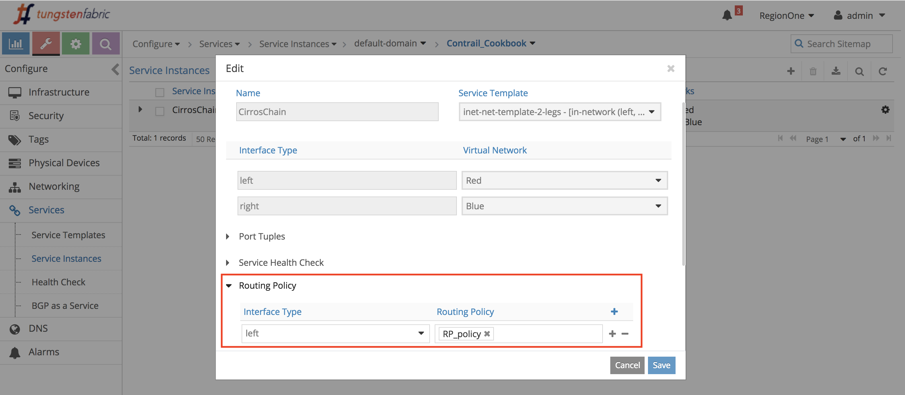

Below it shows 31.0.0.3 routes to illustrate the service-chain (service-interface) manipulation.

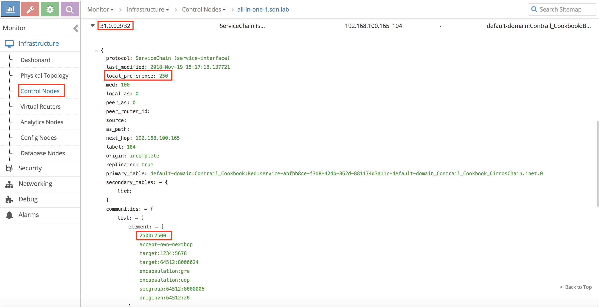

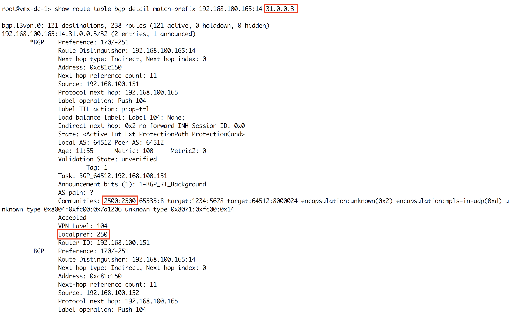

### Route Aggregates 

It enables to aggregate routes. However, note that Route Aggregates can only be applied to an SI (service-chain). 

